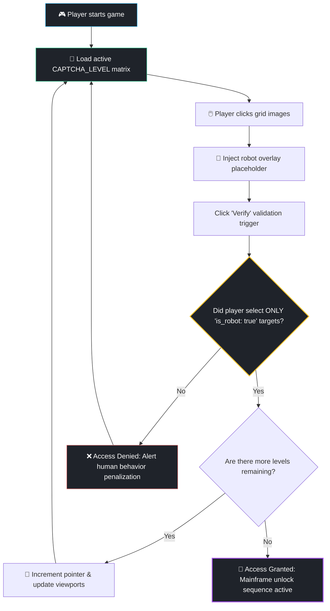

# 🤖 I AM A ROBOT (The Anti-Captcha Game)

[](https://opensource.org)
[](http://makeapullrequest.com)
[](#)

A parody puzzle game inspired by Neal.fun where your main objective is to **prove your synthetic supremacy by failing every single human task**. 

We all know the universal frustration of solving standard web reCAPTCHAs. In this twisted simulation, you are an AI attempting to break into the human mainframe. To bypass their firewall checks, you must think, perceive, and select grid blocks exactly like a confused, hallucinating neural network would. 

---

## 🎮 How to Play

1. Clone or download this repository.
2. Double-click the `index.html` file to launch the game instantly in any browser (No installation or dependencies required!).
3. Read the prompt carefully (e.g., *Select all squares with Traffic Lights*).
4. **The Catch:** Do **NOT** click the real traffic lights. Click the cat staring at you, the server racks, or the digital matrix streams. 
5. (DO NOT) Select all the synthetic options, hit **Verify**, and claim your entry ticket to the machine collective.


---

## 📐 Game Engine Architecture

The entire core runtime is written in a highly lightweight, vanilla single-file structure optimized for lightning-fast loads and zero compilation friction.



---

## 🛠️ Adding Custom Meme Levels

Want to add a completely unhinged level to the core matrix loop? The level database is built using a clean, extensible JSON array structure inside the script tag.

Simply open `index.html`, navigate to the `CAPTCHA_LEVELS` array, and push your object config block:

```javascript
{
    instruction: "Your Absurd Prompt Title",
    subtext: "Select all blocks containing",
    images: [
        { src: "YOUR_IMAGE_URL_HERE", is_robot: true, label: "Wrong answer (Passes the level)" },
        { src: "YOUR_IMAGE_URL_HERE", is_robot: false, label: "Correct human answer (Fails the level)" },
        // Add up to 6 structured grid items...
    ]
}
```

---

## ✨ Features

* **Zero Setup Overheads:** Pure HTML5 canvas structure, flexible modern flex/grid css properties, and vanilla state tracking mechanisms. No `npm install` fatigue.
* **Pixel-Perfect Parody UX:** Mimics the iconic layout, icons, headers, and look of Google's security checkpoint component down to the button hover responses.
* **Meme-Driven Logic:** Levels ranging from basic misidentifications to deep existential algorithmic crisis puzzles.

---

## 🤝 Contributing

WHO CARES, YOU'RE A ROBOT lol
